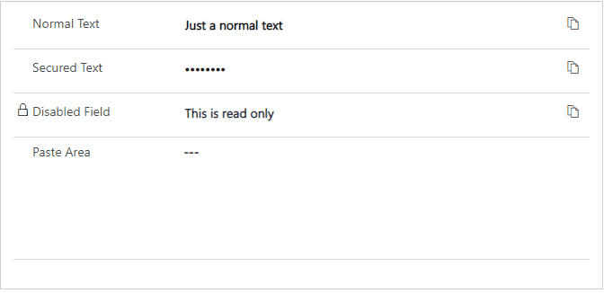

# Clipboard Control

## Overview

Control that adds a copy to clipboard button to a single line of text field.

## Download

## Configuration

| Field                | Description                                                 |
| -------------------- | ----------------------------------------------------------- |
| Show/hide text input | Option to hide text as * signs or showing in the normal way |

## Preview

## Features

- Adds copy to clipboard button to the text field